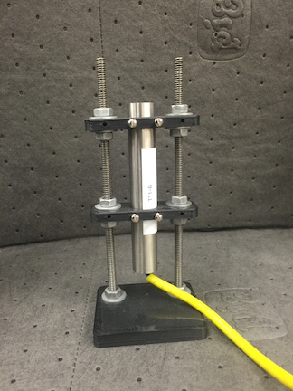
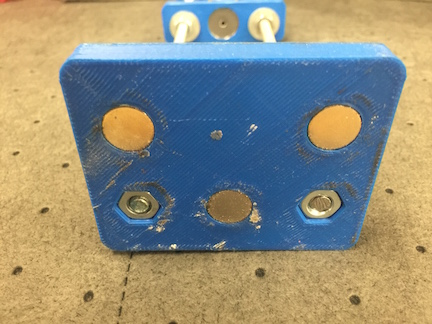
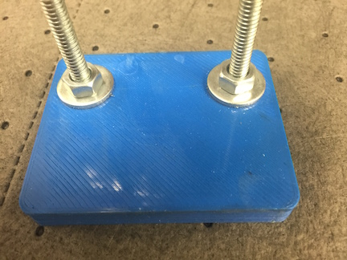
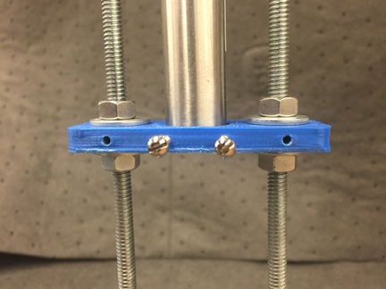
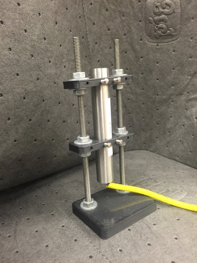
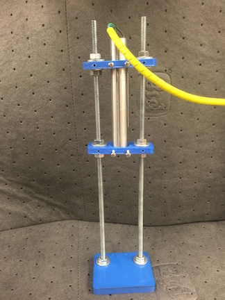
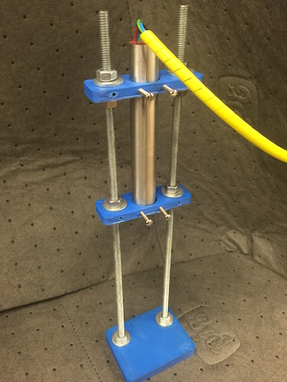

# Magnetic DCDT Holder and Accessories

Direct Current Displacement Transducers (DCDTs) are a great way to measure the
linear position of an object. Often times affixing the DCDT to the test subject
can be problematic though. This repository contains a versatile magnetic DCDT
holder that is easily adjusted and re-mixed to suit your application. As-is the
design supports 0.75" diameter transducers, a very common size. The repository
also contains brackets for labeling DCDT cores (essential to keep calibrations
from getting mixed) and mounts for the DCDT cores to a perpendicular surface. See the photos folder for many pictures and examples of use!

## Required Materials
- (1) 3D printed base
- (2+) 3D printed DCDT mounting brackets
- (2) 1/4" all-thread rod cut to desired mounting system height
- (12) 1/4" nuts
- (10) 1/4" washers
- (3) N48 Neodymium Magnets ([Can be purchased from Amazon](http://amzn.com/B001KV38ES))
- Super Glue
- 4-40 tap
- (4) 4-40 x 1" screws

## Assembly

- Trim the rafting legs off of each part and sand smooth.
- Tap the DCDT mounting holes in the DCDT brackets with the 4-40 tap and insert the screws.
- Insert 1/4" nuts into the bottom of the base bracket. Secure with a small amount of glue.
- Place a couple drops of glue into each magnet well in the base. Insert the magnets.
- Screw one nut about 1" onto each all-thread rod. Place a washer.
- Screw the all-thread rods into the base. Tighten the top nut lightly to secure the rods.
- Screw a nut and washer combination onto each all-thread rod.
- Place a DCDT bracket onto the all-thread rods.
- Add another nut/washer combination and secure the DCDT bracket in-place where desired.
- Screw a nut and washer combination onto each all-thread rod.
- Place a DCDT bracket onto the all-thread rods.
- Add another nut/washer combination and secure the DCDT bracket in-place where desired.
- Repeat if necessary for more brackets.
- Affix the DCDT.
- Have a beverage.

## Photos

