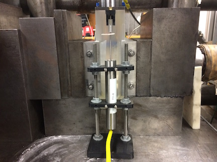

# DCDT Brackets and Accessories

Direct Current Displacement Transducers (DCDTs) are a great way to measure the
linear position of an object. Designing brackets to hold DCDTs and their cores are one of the more
time consuming tasks with their implementation. Here I have collected a group of objects to
help utilize DCDTs in a variety of measurement situations. Each subfolder has projects in that
category, each project has the OpenSCAD files, STL files, photos, and a README with
a description and instructions.

## DCDT Holders
Brackets to hold the body of a DCDT, either mounted to a fixed reference, custom surface, or to the body in motion.

* [Magnetic DCDT Holder and Base](DCDT_Holders/Magnetic_DCDT_Holder)
* [Slotted Rail DCDT Holder](DCDT_Holders/Screw_Rail_DCDT_Holder)

## DCDT Core Mounts
Holding the core of a DCDT parallel to the motion and firm is a crucial task. These brackets provide a way to mount cores to various surfaces and systems.

* [Glue on Arms (long and short)](DCDT_Core_Mounts/glue_on_arms)
* [Sliding holder for cores](DCDT_Core_Mounts/sliding_core_holder)

## Accessories  
Useful accessories for DCDT operation and parts storage.

* [Core Labels](Accessories/core_label)
* ["L" Brackets for Rails](Accessories/rail_L_brackets)
* ["U" Brackets for Rails](Accessories/rail_U_brackets)
